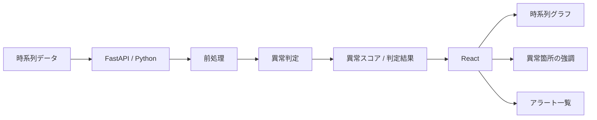

# 企画候補3：ITシステム異常検知ダッシュボード

> **CPU使用率、レスポンスタイム、エラー件数などの時系列データをPythonで分析し、普段と違う変化をReact上で見つけやすくする。**

## 30秒概要

CPU使用率やレスポンスタイム、エラー率などのデータから、普段と違う変化をPythonで検出し、Reactのグラフ上で分かりやすく表示する監視ダッシュボードです。最初はサンプルデータを使って、Pythonで異常判定し、その実結果をReact上で可視化するところまでを完成させます。その後、PostgreSQLへの蓄積や実際のPCからの自動収集、より高度な異常検知へ発展できます。**Pythonのデータ分析とReactの可視化を両方経験できる**企画です。

## 企画比較用サマリー

| 項目 | 内容 |
| --- | --- |
| 何を作るか | ITシステムのメトリクスを蓄積・分析し、異常候補を時系列グラフ上で可視化する監視ダッシュボード |
| 解決する課題 | 多数の監視データを人が常時見続けなくても、普段と違う変化や確認すべき時間帯を見つけやすくする |
| Reactで触れること | 時系列グラフ、フィルタ、状態管理、API通信、異常箇所の強調、アラート一覧、詳細表示 |
| Pythonで触れること | FastAPI、pandas等によるデータ処理、統計的な異常判定、時系列データ分析、DB連携、データ収集 |
| 3人での縦割り | CPU、エラー率、レスポンスタイムなどの監視機能ごとに、各自がReact → Pythonまで担当できる |
| 14営業日の最小構成 | 用意した時系列データをPythonで異常判定し、実結果をReactのグラフ上へ表示するところまで |
| 主な発展先 | PostgreSQL蓄積、PCからの自動収集、複数指標分析、リアルタイム更新、通知、機械学習による異常検知 |

> [!NOTE]
> 今回の第一目的はReact / Pythonのキャッチアップ。最初から本番監視基盤や高度な機械学習を作るのではなく、入力データ → 分析 → API → 可視化という縦の流れを小さく完成させる。

---

## 1. 何を作るのか

Webサービスやシステムでは、CPU使用率、メモリ使用量、レスポンスタイム、エラー件数など、多数の値が時間とともに変化する。

本企画では、こうした**時系列データをPythonで分析し、普段と異なる変化を「異常候補」として検出して、React上で分かりやすく表示するダッシュボード**を作る。

最終的には、次のような流れを目指す。

```text
システムメトリクス
    ↓
蓄積
    ↓
Pythonで分析
    ↓
異常候補を検出
    ↓
FastAPI
    ↓
Reactでグラフ・警告表示
```

Phase 1ではデータ収集・DBまで広げず、まずは用意したサンプルデータを使って分析と可視化を完成させる。

---

## 2. どんな困りごとを解決するのか

### 想定する利用シーン

Webサービスや社内システムを運用している担当者が、システムの状態を確認する場面を想定する。

監視対象には、例えば次のような指標がある。

- CPU使用率
- メモリ使用率
- APIレスポンスタイム
- HTTPエラー件数・エラー率
- リクエスト数
- ジョブ処理時間

これらは1つだけを見るのではなく、複数の指標を継続的に確認する必要がある。

しかし、人がすべてのグラフを常時監視するのは難しい。

例えば通常時は、

```text
CPU使用率           30〜50%
レスポンスタイム    100〜300ms
エラー率            0〜1%
```

程度だったものが、ある時間帯から、

```text
CPU使用率           90%
レスポンスタイム    1500ms
エラー率            8%
```

になっていたとしても、監視対象が増えるほど変化を見逃しやすくなる。

特に困るのは、次のようなケース。

- 急激な異常だけでなく、少しずつ悪化する変化を見逃す
- 監視項目が多く、どのグラフから確認すればよいか分からない
- 障害発生後に大量の時系列データを遡って原因を探す必要がある
- 「正常値」が時間帯やシステムによって異なり、固定閾値だけでは判断しづらい
- 複数の指標が同時に悪化していることに気づきにくい

この企画では、**人がすべてのデータを見るのではなく、Pythonが「普段と違う場所」を絞り込み、人が確認すべき箇所を見つけやすくする**ことを価値とする。

> [!NOTE]
> 異常検知結果だけで障害原因を自動断定するものではない。システムが異常候補を提示し、最終的には人が確認する前提とする。

---

## 3. どう解決するのか

Pythonで時系列データを分析し、「通常状態からどの程度外れているか」を判定する。

Reactでは、その結果をグラフ・ステータス・アラート一覧として表示する。



最初から機械学習を使うのではなく、テストしやすい単純な判定から始める。

候補例：

- 固定閾値
- 平均値との差
- Z-score
- 移動平均からの乖離
- IQRによる外れ値判定

必要性が出た段階で、Isolation Forestなどの機械学習による異常検知も検討する。

---

## 4. 想定する主な機能

### 機能A：時系列データの分析

- CSVまたはJSON形式のデータを読み込む
- Pythonでデータを前処理する
- 指標ごとに異常候補を判定する
- 異常時刻・値・スコアなどを返す

### 機能B：監視ダッシュボード

- Reactで時系列グラフを表示する
- 異常箇所を視覚的に強調する
- 正常 / 注意 / 異常などの状態を表示する
- 対象期間や指標を切り替える

### 機能C：異常詳細・アラート一覧

- 検出された異常を一覧表示する
- 発生時刻、対象指標、実測値などを確認する
- 選択した異常をグラフ上で確認できるようにする

### 発展機能：データ蓄積・自動収集

- PostgreSQLへ監視データを保存する
- PythonからPCのCPU・メモリ情報などを定期収集する
- Reactを定期更新して現在状態を表示する

---

## 5. Reactで何を実装できそうか

- TypeScript / Reactの基本
- コンポーネント設計
- 状態管理
- FastAPIとのAPI通信
- ローディング・エラー処理
- 時系列グラフ
- 複数指標の表示切り替え
- 日時・期間フィルタ
- 異常箇所の強調表示
- アラート一覧
- 詳細パネル
- ダッシュボードUI
- 定期更新が必要になった場合の非同期状態管理

### Reactでキャッチアップできそうなこと

単なるCRUD画面ではなく、**取得した分析結果を状態として持ち、グラフ・一覧・詳細表示を連動させるUI**を経験できる。

「データをどう見せれば異常に気づきやすいか」という可視化・UI設計も学習対象にできる。

---

## 6. Pythonで何を実装できそうか

- Pythonの基本
- FastAPIによるAPI実装
- pandas等を使ったデータ加工
- 時系列データの扱い
- 平均・標準偏差などの統計処理
- 移動平均
- 外れ値判定
- 異常スコア計算
- 欠損値・不正値の処理
- PostgreSQLへのデータ保存・取得
- PCメトリクスの収集
- 発展としてscikit-learn等による異常検知

### Pythonでキャッチアップできそうなこと

CRUD中心ではなく、**データを受け取る → 整形する → 分析する → 判定する → APIとして返す**というPythonのデータ分析分野の強みを経験できる。

判定ロジックを段階的に高度化できるため、基本的な統計処理から機械学習まで発展させやすい。

---

## 7. 3人でどう縦割りできそうか

完全に「React担当」「Python担当」と分けず、監視する指標・利用者価値を単位に縦割りする。

| 担当機能の例 | React側 | Python側 |
| --- | --- | --- |
| CPU監視 | CPUグラフ、異常表示、詳細 | CPUデータ分析、異常判定 |
| レスポンスタイム監視 | 時系列グラフ、遅延アラート | 移動平均、遅延異常判定 |
| エラー監視 | エラー率表示、アラート一覧 | エラー急増判定、集計 |

各担当者が、**React表示 → API → Python分析 → レスポンス → React表示**まで一通り担当する。

> [!NOTE]
> 3人が同じ分析処理をコピーして作るのではなく、共通部分をどこまで再利用するかは設計時に整理する。縦割りを優先しつつ、責務重複を増やさないようにする。

---

## 8. 14営業日の最小構成

### Phase 1：サンプルデータを異常判定してグラフ表示する

最初の14営業日では、本物のサーバー監視やDB蓄積まで広げず、制御可能なサンプルデータを利用する。

例：

```csv
timestamp,cpu_usage,response_time_ms,error_rate
10:00,32,120,0.2
10:01,35,130,0.1
10:02,31,125,0.3
10:03,92,1800,8.0
```

処理の流れ：

```text
サンプル時系列データ
    ↓
FastAPI
    ↓
Pythonで異常判定
    ↓
異常時刻・値・判定結果を返す
    ↓
Reactでグラフ表示
    ↓
異常箇所を強調
```

### Phase 1の完成条件（仮）

次が一通り動けばPhase 1の完成候補とする。

- 正常値と異常値を含むサンプルデータを用意できる
- ReactからFastAPIへ分析要求を送信できる
- Python側で実際の異常判定処理を実行できる
- 異常の有無・時刻・対象値などをAPIレスポンスとして返せる
- Reactが実レスポンスを受け取り、時系列グラフへ表示できる
- 異常と判定された箇所をグラフ上で識別できる
- 正常データ、明らかな異常、データ不足、欠損値など最低限のテストケースを確認できる
- React側とPython側をモックだけで完了させず、実際のFastAPIレスポンスをReact本番コードで処理する結合確認ができる

### Phase 1でテストしやすくする方針

最初からAIモデルに「異常かどうか」を委ねず、期待結果を固定できる判定ロジックから始める。

例えば、

```text
[30, 32, 31, 29, 95]
```

というデータに対して「95を異常として検出する」といった入力と期待結果を用意する。

これにより、Python側の単体テストで次を確認しやすくする。

- 正常データ → 異常なし
- 明らかな外れ値 → 異常あり
- データ不足 → 判定不可または定義した扱い
- 欠損値 → 定義した方法で処理
- 境界値 → 仕様通りの結果

> [!IMPORTANT]
> これは企画比較用の仮完成条件。採用した場合、最終的な判定方式・テストデータ・完成条件はPhase 1開始前に3人で確定する。

---

## 9. その後どう拡張できるか

### Phase 2：PostgreSQLへ時系列データを蓄積する

監視値をDBへ保存し、期間を指定して分析できるようにする。

例：

```text
system_metrics

id
recorded_at
cpu_usage
memory_usage
response_time_ms
error_rate
```

構成：

```text
PostgreSQL
    ↓
FastAPI / Python
    ↓
分析
    ↓
React
```

### Phase 3：実際のPCからデータを収集する

PythonからCPU使用率・メモリ使用率などを取得して、DBへ定期的に保存する。

```text
PC
↓
Python Collector
↓
PostgreSQL
↓
Python分析
↓
FastAPI
↓
Reactダッシュボード
```

### Phase 4：リアルタイム監視に近づける

- Reactから一定間隔で最新データを取得する
- 最新状態をダッシュボードへ反映する
- 新しい異常が発生した場合に警告する

### Phase 5：分析方法を高度化する

- 時間帯ごとの通常値を考慮する
- 複数指標を組み合わせて判定する
- 異常スコアを導入する
- Isolation Forestなどを検討する
- 過去の異常履歴と比較する

### さらに発展できそうなこと

- メール・Slack等への通知
- 複数システムの監視
- ユーザーごとのダッシュボード
- 異常へのコメント・対応履歴
- 障害発生前後のデータ比較
- ログデータとの組み合わせ
- Dockerコンテナ・クラウド環境の監視

---

## 10. ポートフォリオとして何をアピールできるか

- React / TypeScriptとPython / FastAPIを組み合わせたフルスタック開発
- Pythonによる時系列データ処理・分析
- 統計的な異常検知ロジック
- 分析結果を利用者へ伝えるReactダッシュボード設計
- Frontend / Backend間のAPI契約設計
- PostgreSQLを使った時系列データ蓄積への発展
- 実データ収集 → 蓄積 → 分析 → 可視化という一連のデータフロー
- 異常検知ロジックをテスト可能な形で設計した経験
- 機能単位でReact → Pythonまで担当する縦割り共同開発
- フェーズごとに小さく完成させ、分析方式を段階的に高度化した開発プロセス

単に「グラフを作った」「機械学習を使った」ではなく、**監視データから人が確認すべき異常候補を絞り込み、実際のUIへつなげた**ことを説明できる企画にする。

---

## 11. 技術的な懸念・事前調査が必要なこと

企画選定時点では、次を確定事項とせず要調査とする。

- Phase 1で採用する異常判定方式
- 「正常」「異常」をどのように定義するか
- 指標ごとに同じ判定方式を使えるか
- サンプルデータをどの程度現実的に作るか
- グラフライブラリを何にするか
- 異常点をReact上でどのように表現するか
- PostgreSQLへ蓄積する場合のテーブル設計
- 実データ収集を行う場合の収集周期
- データが増えた場合の保持期間・集計方法
- リアルタイム性をどこまで求めるか
- 機械学習を使う場合、学習データや評価方法をどうするか
- 3人の縦割りと共通分析ロジックの責務境界をどう設計するか
- 14営業日でどの指標まで対象とするのが妥当か

特に「異常検知の精度」を最初から完成条件にすると評価が難しくなるため、Phase 1では**仕様として期待結果を定義できる単純な判定方式**を優先する。

---

## 12. 技術構成（候補）

| 領域 | 技術 | 役割 / 採用理由 |
| --- | --- | --- |
| Frontend | TypeScript + React | グラフ、フィルタ、アラート、詳細表示 |
| API | Python + FastAPI | データ取得、分析処理呼び出し、結果返却 |
| Data Processing | pandas / Python標準機能等を検討 | 時系列データの加工・集計 |
| Analysis | Pythonによる統計処理 | Phase 1の異常判定。まずは決定的なロジックを優先 |
| ML | scikit-learn等を必要に応じて検討 | 後続PhaseでIsolation Forest等を検討する場合の候補 |
| Database | PostgreSQL | Phase 2以降のメトリクス・異常履歴保存 |
| Data Collection | Pythonライブラリ等を検討 | Phase 3以降のPCメトリクス収集 |

### 技術選定で意識すること

「Pythonだから機械学習を使う」ではなく、まず問題を簡単な方法で解けるかを確認する。

Phase 1ではテスト可能性と理解しやすさを優先し、必要性が確認できた段階で分析手法を高度化する。

---

## 13. 今回やらないこと

Phase 1では以下を対象外とする。

- 本番サービスへの導入
- 24時間365日の監視
- 高可用性監視基盤
- 大量サーバーの監視
- 機械学習モデルの独自学習
- 障害原因の自動特定
- 自動復旧
- 通知システム
- PostgreSQLへの常時蓄積
- 実PCからの自動メトリクス収集
- WebSocket等による高度なリアルタイム化

まずは、制御可能な時系列データを使って**分析 → API → React可視化**を完成させる。

---

## 14. 企画比較時に話し合いたいポイント

1. 3人ともデータ分析・監視システムに興味があるか
2. Reactを十分に触れる企画になっているか
3. Pythonのデータ分析分野を十分に触れられるか
4. 3人それぞれがReact → Pythonまで縦割りできそうか
5. 14営業日の最小構成を一度完成させられそうか
6. プロダクトとしての価値や、その後の拡張性があるか
7. Phase 1で対象にする指標を何にするか
8. Phase 1の異常判定方式をどこまで単純化するか
9. PostgreSQL・実データ収集まで発展させたいか
10. 機械学習による異常検知まで将来的に試したいか