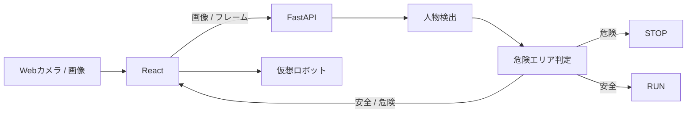

# 企画候補1：フィジカルAI安全監視システム

> **カメラで人を認識し、危険エリアへの侵入を検知したら、仮想ロボットを停止させる。**

## 30秒概要

カメラ画像から人を検出し、危険エリアに入った場合に仮想ロボットを停止させるプロトタイプです。Reactでは画像入力や検出結果・ロボット状態の表示、Pythonでは人物検出や危険判定を担当します。最初の14営業日では、静止画像をPythonへ送り、実際の人物検出結果をReactへ返して表示するところまでを完成させます。その後、Webカメラ、危険エリア判定、仮想ロボット制御へ広げ、**認識 → 判断 → 行動**までを体験できる企画です。

## 企画比較用サマリー

| 項目 | 内容 |
| --- | --- |
| 何を作るか | Webカメラや画像から人物を検出し、危険エリアへの侵入を判定して仮想ロボットの状態を変えるプロトタイプ |
| 解決する課題 | 人とロボットが共存する環境で「認識結果を安全判断・行動変更につなげる」流れを分かりやすく体験・検証する |
| Reactで触れること | 画像入力、状態管理、API通信、非同期処理、検出結果の可視化、危険エリア設定、仮想ロボット表示 |
| Pythonで触れること | FastAPI、画像データ処理、物体検出モデル利用、座標処理、危険判定ロジック、API設計 |
| 3人での縦割り | 人物検出、危険エリア判定、仮想ロボット制御の3機能に分け、各自がReact → Pythonまで担当できる |
| 14営業日の最小構成 | 静止画像をReactから送信し、Pythonで人物検出した実結果をReactに表示するところまで |
| 主な発展先 | Webカメラ、危険エリア判定、仮想ロボット制御、リアルタイム化、実機連携 |

> [!NOTE]
> 今回の第一目的はReact / Pythonのキャッチアップとし、実運用レベルの安全装置を作ることは目的としない。

---

## 1. 何を作るのか

React と Python を使って、現実世界の情報を取り込み、その情報をもとにシステムが判断し、振る舞いを変える流れを作る。

フィジカルAIの基本的な流れを、実機なしのプロトタイプとして段階的に体験する。

**Sense（認識） → Think（判断） → Act（行動）**

- **Sense**：画像やWebカメラ映像から人を検出する
- **Think**：人の位置と危険エリアを比較し、危険かどうかを判定する
- **Act**：危険なら仮想ロボットを停止し、画面に警告する

最初からすべてを実装するのではなく、Phase 1ではReact ↔ Python ↔ 画像認識という最小の縦の流れを完成させる。

---

## 2. どんな困りごとを解決するのか

### 想定する利用シーン

工場や倉庫などで、搬送ロボットと人が同じ空間にいる状況を想定する。

通常時はロボットが稼働しているが、人が危険エリアへ入った場合には停止する必要がある。

この企画では実際の工場設備を制御するのではなく、次のような疑似環境を作る。

- 人の存在や位置を画像から認識する
- 認識結果を安全・危険の判断につなげる
- 判断結果によってシステムの振る舞いを変える

AIを「画像から人を検出するだけ」で終わらせず、**AIの出力をアプリケーションの判断と行動につなげる部分**まで学習対象にする。

---

## 3. どう解決するのか

最終的には、次の流れを1つのWebアプリケーションとしてつなぐ。



### 画面イメージ

```text
┌───────────────────────────────┬──────────────────┐
│                               │ SYSTEM STATUS    │
│       Webカメラ映像           │                  │
│                               │ Person : YES     │
│     ┌──────────┐              │ Danger : ALERT   │
│     │  PERSON  │              │ Robot  : STOPPED │
│     └──────────┘              │                  │
│                               │ ⚠ 危険エリア侵入 │
│  ┌─────────────────────┐      │                  │
│  │     DANGER AREA     │      │                  │
│  └─────────────────────┘      │                  │
└───────────────────────────────┴──────────────────┘
```

---

## 4. 想定する主な機能

### 機能A：画像入力・人物検出

- Reactから画像を選択する
- FastAPIへ画像を送信する
- Python側で人物を検出する
- Bounding Boxや信頼度などの結果を返す
- React上へ検出結果を表示する

### 機能B：危険エリア設定・侵入判定

- React上で危険エリアを設定する
- 人物の位置と危険エリアを比較する
- SAFE / DANGERを判定する
- 判定結果を画面へ反映する

### 機能C：仮想ロボット制御

- React上に仮想ロボットを表示する
- SAFEならRUN、DANGERならSTOPという状態を持つ
- Python側の判断結果をReactの表示・動作へ反映する

### 発展機能：Webカメラ・リアルタイム化

- `getUserMedia()`でWebカメラを扱う
- 一定間隔で画像を送信する
- 必要に応じて通信方式を見直す

---

## 5. Reactで何を実装できそうか

- TypeScript / Reactの基本
- コンポーネント設計
- 状態管理
- ファイル入力
- Webカメラ入力
- FastAPIとのAPI通信
- 非同期処理とローディング・エラー表示
- Bounding BoxなどAI処理結果の可視化
- 危険エリア設定UI
- SAFE / DANGERの状態表示
- 仮想ロボットの状態反映

### Reactでキャッチアップできそうなこと

単なる画面作成だけではなく、**ユーザー操作 → API通信 → 状態更新 → 表示変更**というReactの基本的なデータフローを一通り経験できる。

画像やカメラなど通常のフォームより扱いが複雑な入力を題材にできることも特徴。

---

## 6. Pythonで何を実装できそうか

- Pythonの基本
- FastAPIによるAPI実装
- リクエスト・レスポンス設計
- 画像データの受信
- 物体検出モデルの利用
- Bounding Boxなどの座標処理
- 危険エリアとの位置関係判定
- SAFE / DANGER判定ロジック
- 例外処理・入力検証

### Pythonでキャッチアップできそうなこと

CRUDだけではなく、**画像を受け取る → AIモデルで処理する → 座標を使って判断する → APIとして結果を返す**というPythonらしい処理を経験できる。

---

## 7. 3人でどう縦割りできそうか

完全に「React担当」「Python担当」と分けず、利用者から見える機能単位でReactとPythonの両方を担当する。

| 担当機能の例 | React側 | Python側 |
| --- | --- | --- |
| 画像入力・人物検出 | 画像選択、API送信、検出結果表示 | 画像受信、人物検出、検出結果返却 |
| 危険エリア判定 | エリア設定UI、SAFE / DANGER表示 | 座標比較、侵入判定 |
| 仮想ロボット制御 | ロボット表示、RUN / STOP反映 | 状態判断、制御結果返却 |

担当者そのものは企画段階では決めず、**3人それぞれにReact → API → Python → レスポンス → Reactという縦の流れを持たせられるか**を企画選定時の判断材料にする。

> [!NOTE]
> Phase 1を非常に小さくした場合、上記3機能すべてを同時に実装するとは限らない。3人への具体的な分担は、Phase 1の完成条件を確定するときに調整する。

---

## 8. 14営業日の最小構成

### Phase 1：静止画像から人物を検出して結果を表示する

最初の14営業日では、リアルタイム監視や仮想ロボット制御まで欲張らず、まず次の縦1本を完成させる。

```text
画像アップロード
    ↓
React
    ↓
FastAPI
    ↓
Pythonで人物検出
    ↓
検出結果をJSONで返す
    ↓
Reactに表示
```

### Phase 1の完成条件（仮）

次が一通り動けばPhase 1の完成候補とする。

- Reactから画像を選択できる
- ReactからFastAPIへ画像を送信できる
- Python側で実際に人物検出処理を実行できる
- 人物の有無と、必要であればBounding Box・信頼度などをレスポンスとして返せる
- Reactが実レスポンスを受け取り、画面へ表示できる
- 人物がいない画像や不正な入力など、最低限のエラーケースを確認できる
- React側とPython側をモック同士で終わらせず、実際のフロントから実際のPython APIまで結合確認できる

> [!IMPORTANT]
> これは企画比較用の仮完成条件。最終的なPhase 1の完成条件・テスト範囲・対象画像などは、企画決定後〜Phase 1開始前に3人で確定する。

---

## 9. その後どう拡張できるか

### Phase 2：Webカメラ入力

静止画像アップロードをWebカメラ入力へ広げる。

### Phase 3：危険エリア判定

```text
人物検出
    +
危険エリア
    ↓
侵入判定
    ↓
SAFE / DANGER
```

### Phase 4：仮想ロボット制御

```text
SAFE   → Robot RUN
DANGER → Robot STOP
```

ここまで到達すると、**Sense → Think → Act**の一連の流れが完成する。

### さらに発展できそうなこと

- 人だけでなく台車・車両・障害物なども検出
- ロボットとの距離による危険度判定
- 人の移動方向を考慮した判定
- 複数カメラ対応
- 通信方式の見直しによるリアルタイム性向上
- 仮想ロボットをより本格的なシミュレーションへ変更
- Raspberry Piなどを使った実機連携

将来的には、

```text
React
  ↓
Python / AI
  ↓
Raspberry Pi等
  ↓
実際のロボット・モーター
```

という方向へ発展させることもできる。

---

## 10. ポートフォリオとして何をアピールできるか

- React / TypeScriptとPython / FastAPIを組み合わせたフルスタック開発
- 画像データを扱うAPI設計
- 既存のAIモデルをWebアプリケーションへ組み込む実装
- AIの認識結果を業務・制御ロジックへ接続する設計
- ReactとPythonを機能単位で縦割りした共同開発
- Frontend / Backend間の契約設計
- 非同期処理・エラー処理・状態管理
- 実機を使わずにフィジカルAIのSense → Think → Actをプロトタイプ化した経験
- フェーズごとに完成条件を置き、振り返りながら拡張した開発プロセス

単に「YOLOを動かした」ではなく、**認識結果を受けてシステムの判断と振る舞いが変わるところまで作った**ことを説明できる点を強みにする。

---

## 11. 技術的な懸念・事前調査が必要なこと

企画選定時点では、次を確定事項とせず要調査とする。

- 使用する物体検出モデルとライセンス条件
- 開発メンバーのPCで推論速度が実用的か
- CPUのみでもPhase 1を進められるか、GPU利用を前提にするか
- 画像サイズ・形式・送信方法をどう限定するか
- Bounding BoxをReact上へどう重ねて表示するか
- 危険エリアと人物領域の重なりをどの条件で「侵入」とするか
- Webカメラ化した場合のフレーム送信頻度と負荷
- HTTPのままで十分か、リアルタイム化の段階で別方式が必要か
- 3人がPhase 1から無理なく縦割りできる粒度に分けられるか
- 14営業日でどこまでを完成条件とするのが妥当か

未確認事項を企画段階で無理に確定せず、採用候補になった段階で優先的に調査する。

---

## 12. 技術構成（候補）

| 領域 | 技術 | 役割 / 採用理由 |
| --- | --- | --- |
| Frontend | TypeScript + React | 画像・カメラ入力、検出結果可視化、危険エリア設定、仮想ロボット表示 |
| Camera | MediaDevices / `getUserMedia()` | ブラウザからWebカメラを利用する場合の候補 |
| API | Python + FastAPI | Reactから画像を受け取り、Python処理結果をJSON等で返す |
| Object Detection | Ultralytics YOLO系モデル等を検討 | 人物検出とBounding Box取得 |
| Image Processing | OpenCV（必要になった場合） | フレーム加工・座標処理などを補助する候補 |
| Communication | まずHTTP | MVPでは構成を単純化し、必要性が出た段階でリアルタイム通信を検討 |

### 技術選定で意識すること

最初から技術を増やしすぎない。

OpenCVやWebSocket等は「使えるから入れる」のではなく、Phase 1または後続Phaseの課題を解決するために必要になった場合に採用する。

---

## 13. 今回やらないこと

React と Python のキャッチアップ対象を広げすぎないため、最初から以下までは扱わない。

- Raspberry Pi / Arduino
- モーター制御
- ROS / ROS 2
- 距離センサーなどの専用センサー
- 実際の工場設備との連携
- 実運用レベルの安全保証
- 高度なモデル学習・独自モデル作成

まずはPC上で完結するプロトタイプとして成立させる。

---

## 14. 企画比較時に話し合いたいポイント

1. 3人とも画像認識・フィジカルAIに興味があるか
2. Reactを十分に触れる企画になっているか
3. Pythonを十分に触れる企画になっているか
4. 3人それぞれがReact → Pythonまで縦割りできそうか
5. 14営業日の最小構成を一度完成させられそうか
6. プロダクトとしての価値や、その後の拡張性があるか
7. Phase 1を人物検出だけにするか、危険判定まで含めるか
8. 仮想ロボットをどのPhaseで扱うか

---

## 参考

- MDN Web Docs — MediaDevices / getUserMedia  
  https://developer.mozilla.org/en-US/docs/Web/API/MediaDevices/getUserMedia
- FastAPI — WebSockets  
  https://fastapi.tiangolo.com/advanced/websockets/
- Ultralytics YOLO — Predict Mode  
  https://docs.ultralytics.com/modes/predict/